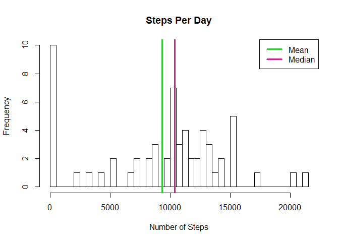
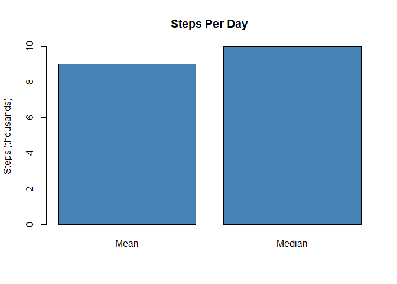
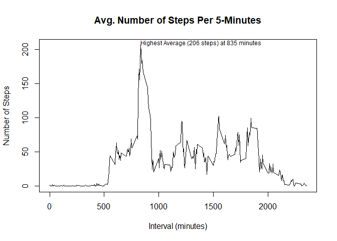
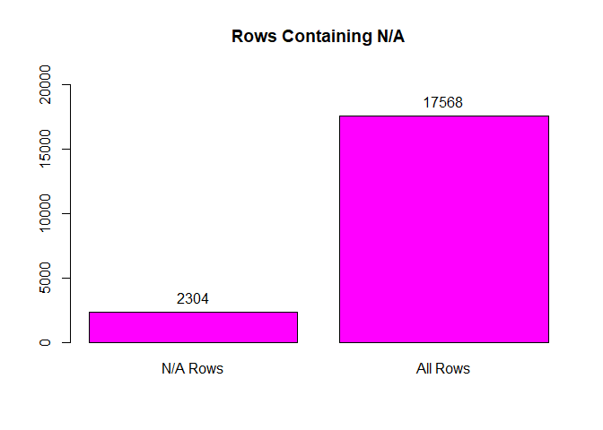
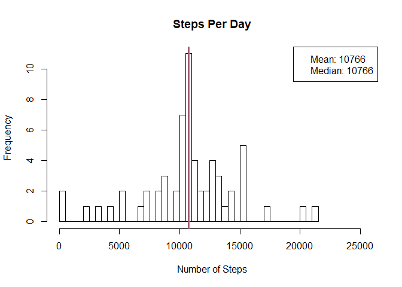
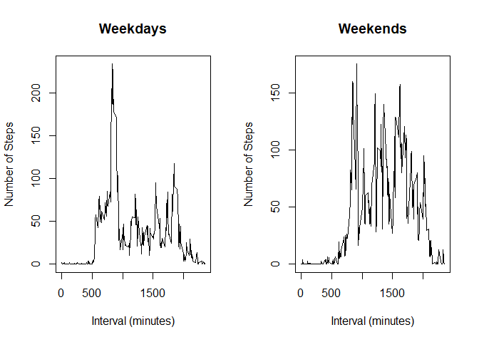

## Loading and preprocessing the data

```r
LoadData <- function() {
    csvFile <- unzip("activity.zip")
    result <- read.csv(csvFile, colClasses=c("integer", "Date", "integer"))
    return(result)
}
```


## What is mean total number of steps taken per day?


```r
GetStepsPerDay <- function(iData) {
    suppressPackageStartupMessages(library(dplyr))
    
    byDate <- aggregate(iData$steps, by=list(iData$date), sum)
    byDate <- data.frame(byDate)
    names(byDate) <- c("Date", "steps")
    byDate[is.na(byDate)] <- 0
    return(byDate)
}

ShowStepsPerDayHist <- function() {
    rawData <- LoadData()
    stepsPerDay <- GetStepsPerDay(rawData)

    hist(stepsPerDay$steps, breaks=dim(stepsPerDay)[1],
         xlab="Number of Steps",
         main="Steps Per Day")
    abline(v=c(mean(stepsPerDay$steps), median(stepsPerDay$steps)), 
           lwd=c(3,3), 
           col=c("limegreen", "violetred"))
    legend("topright", 
           legend=c("Mean", "Median"), 
           col=c("limegreen", "violetred"),
           lwd=3)
}

ShowMeanAndMedian <- function() {
    rawData <- LoadData()
    stepsPerDay <- GetStepsPerDay(rawData)
    
    averages <- data.frame("Name" = as.factor(c("Mean", "Median")),
                           "Value" = c(mean(stepsPerDay$steps), median(stepsPerDay$steps)))
    averages$Value <- as.integer(averages$Value / 1e3)
    barplot(averages$Value,
            ylab="Steps (thousands)",
            names.arg=levels(averages$Name),
            main="Steps Per Day",
            col="steelblue")
}

ShowStepsPerDayHist()
```

<!-- -->

```r
ShowMeanAndMedian()
```

<!-- -->


## What is the average daily activity pattern?

```r
GetDailyActivityPattern <- function(iData) {
    suppressPackageStartupMessages(require(dplyr))
    dailyPattern <- aggregate(iData$steps, by=list(iData$interval), mean, na.rm=TRUE)
    names(dailyPattern) <- c("Interval", "MeanNumberOfSteps")
    return(dailyPattern)
}

PlotActivityTimeSeries <- function() {
    rawData <- LoadData()
    dailyPattern <- GetDailyActivityPattern(rawData)
    
    plot(dailyPattern$Interval, 
         dailyPattern$MeanNumberOfSteps,
         type="l",
         ylab="Number of Steps",
         xlab="Interval (minutes)",
         main="Avg. Number of Steps Per 5-Minutes")
    
    maxSteps <- max(dailyPattern$MeanNumberOfSteps)
    maxRow <- dailyPattern[dailyPattern$MeanNumberOfSteps == maxSteps,]
    text(x=maxRow$Interval, 
         y=maxRow$MeanNumberOfSteps,
         adj=c(0,0),
         cex=0.75,
         paste("Highest Average (", 
               as.integer(maxSteps), 
               " steps) at ",
               maxRow$Interval,
               " minutes",
               sep=""))
}

PlotActivityTimeSeries()
```

<!-- -->


## Imputing missing values

```r
ShowInfoAboutNAs <- function() {
    theData <- LoadData()
    totalNumberOfRows <- dim(theData)[1]
    numberOfNaRows <- sum(is.na(theData))
    
    thePlot <- barplot(c(numberOfNaRows, totalNumberOfRows), 
                       names.arg=c("N/A Rows", "All Rows"),
                       ylim=c(0, as.integer(totalNumberOfRows * 1.2)),
                       main="Rows Containing N/A",
                       col="magenta")
    yOffset = as.integer(numberOfNaRows / 2)
    text(x=thePlot, 
         y=c(numberOfNaRows, totalNumberOfRows)+yOffset, 
         labels=as.character(c(numberOfNaRows, totalNumberOfRows)))
    
}


ReplaceNAsWithMean <- function(rawData) {
    suppressPackageStartupMessages(require(sqldf))
    rawData$steps <- as.numeric(rawData$steps)
    dailyMeans <- GetDailyActivityPattern(rawData)
    
    theQuery <- "
        select 
            case
               when rd.steps is NULL then dm.MeanNumberOfSteps
               else rd.steps
            end [steps],
            rd.date [date],
            rd.interval [interval]
        from rawData rd 
        join dailyMeans dm on dm.Interval = rd.interval
    "
    result <- sqldf(theQuery)
    return(result)
}

ShowHistForReplacedNAs <- function() {
    rawData <- LoadData()
    massagedData <- ReplaceNAsWithMean(rawData)
    stepsPerDay <- GetStepsPerDay(massagedData)
    
    hist(stepsPerDay$steps, breaks=dim(stepsPerDay)[1],
         xlab="Number of Steps",
         xlim=c(0, max(stepsPerDay$steps) * 1.2),
         main="Steps Per Day")
    theMean <- mean(stepsPerDay$steps)
    theMedian <- median(stepsPerDay$steps)
    abline(v=c(theMean, theMedian), 
           lwd=c(3,1), 
           col=c("limegreen", "violetred"))
    legend("topright", 
           legend=c(paste("Mean:", as.integer(theMean), sep=" "), 
                    paste("Median:", as.integer(theMedian), sep=" ")))
}

ShowInfoAboutNAs()
```

<!-- -->

```r
ShowHistForReplacedNAs()
```

<!-- -->


## Are there differences in activity patterns between weekdays and weekends?

```r
AddDayTypeColumn <- function(iData) {
    iData$DayType <- weekdays(iData$date) %in% c("Saturday", "Sunday")
    iData$DayType <- as.factor(iData$DayType)
    levels(iData$DayType) <- c("weekday", "weekend")
    return(iData)
}

PlotActivityByDayType <- function() {
    suppressPackageStartupMessages(require(dplyr))
    rawData <- LoadData()
    withDayType <- AddDayTypeColumn(rawData)
    
    weekdaysTimeSeries <- GetDailyActivityPattern(filter(withDayType, DayType == "weekday"))
    weekendTimeSeries <- GetDailyActivityPattern(filter(withDayType, DayType == "weekend"))
    
    par(mfrow=c(1,2))
    
    plot(weekdaysTimeSeries$Interval, 
         weekdaysTimeSeries$MeanNumberOfSteps,
         type="l",
         ylab="Number of Steps",
         xlab="Interval (minutes)",
         main="Weekdays")
    
    plot(weekendTimeSeries$Interval, 
         weekendTimeSeries$MeanNumberOfSteps,
         type="l",
         ylab="Number of Steps",
         xlab="Interval (minutes)",
         main="Weekends")
}

PlotActivityByDayType()
```

<!-- -->

